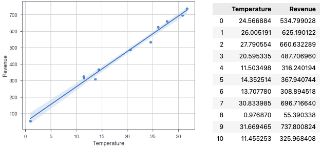

> 回归分析是一种预测建模技术的方法，研究因变量（dependent variable）Y 和自变量（independent variable）X 之间的关系。
> 
> 线性回归通过使用最佳拟合直线（回归线），建立因变量（Y）和一个或多个自变量（X）之间的关系。它的表达式为：Y = a + b * X + e，a为直线截距，b为直线斜率，e为误差项。如果给出了自变量X，就能通过这个线性回归表达式计算出预测值，即因变量Y。
> 
> 如何获得最佳拟合直线（确定a和b的值）？通过最小二乘法（Least Square Method）解决；

今天的内容是关于回归分析中的线性回归模型，将通过Python来逐一讲解线性回归的定义和预测过程和结果。面向的受众可以是初学者，要求有一定的Python编程基础。

需要的运行环境，可以通过Anaconda解决

> 如果运行过程中提示组件不存在，可以通过命令进行安装，如下所示：
> 
> conda install -c conda-forge jupyterthemes
> 
> conda update jupyterthemes
>
> conda install scikit-learn
> 

## 最小二乘法（Least Square Method）

## Reference

> https://github.com/dunovank/jupyter-themes